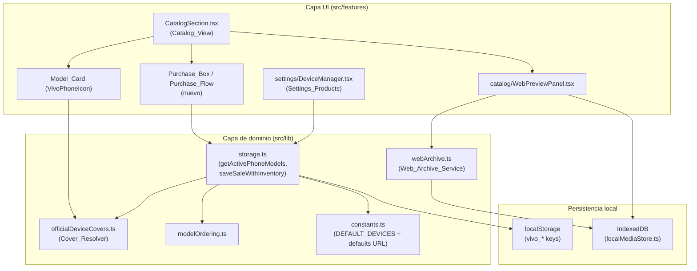
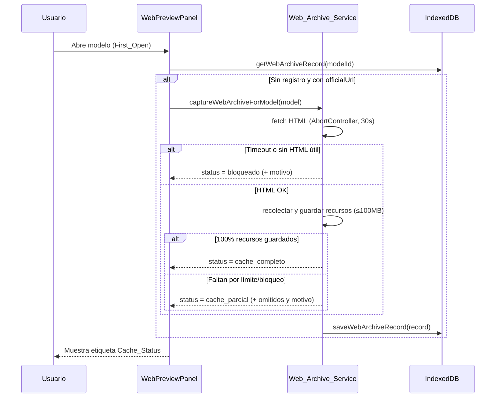
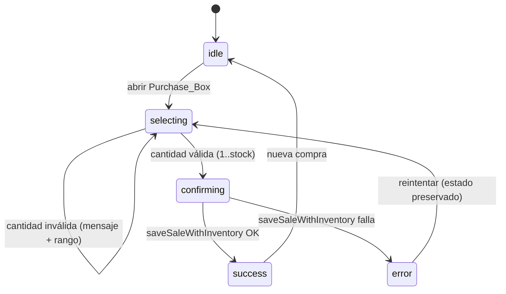

# Design Document

## Overview

Este diseño describe cómo cerrar la experiencia del catálogo de modelos Vivo en Vivo Promotor (React 19 + Vite 6 + TypeScript, empaquetado como APK Android con Capacitor 8, local-first sobre `localStorage` + IndexedDB). El trabajo se apoya en piezas que **ya existen** en el código y se limita a completarlas, cablearlas y pulirlas sin tocar zonas protegidas.

Alcance funcional (derivado de `requirements.md`):

1. **Resolución de portadas por nombre de archivo** — garantizar que las 12 portadas oficiales (6 modelos × 2 colores) se resuelvan y muestren sin omitir ninguna, usando `normalizeTextKey` sobre `src/lib/officialDeviceCovers.ts`.
2. **Reconciliación Y04/Y21d** — resolver a favor del nombre de archivo cuando la tabla de links y el archivo real difieren, y registrar la discrepancia.
3. **Links oficiales por modelo** — sembrar la `officialUrl` por defecto de cada modelo sin sobrescribir el valor que el usuario haya configurado.
4. **Descarga y caché en primer arranque** — cablear la captura best-effort de la web oficial (best-effort) declarando `Cache_Status`, reutilizando `webArchive.ts` + `WebPreviewPanel.tsx` + `localMediaStore.ts`.
5. **Visualización de los 6 modelos** — mantener la tarjeta SVG (`VivoPhoneIcon`), orden desde `modelOrdering.ts`, y acción de web oficial.
6. **Interfaz de compra (Purchase_Box / Purchase_Flow)** — nueva última caja del catálogo que registra la venta reutilizando `saveSaleWithInventory` de `storage.ts` **sin modificar su implementación**.

Alcance de entrega (pedido explícito del usuario, adicional a los requisitos):

7. **Pulido de diseño/estilo** — concepto visual consistente, mobile-first, claro/oscuro, en todas las secciones (Registro, Calendario, Catálogo, Puerquito/Ingresos, Ajustes), sin reintroducir coach/retos/logros/galerías/estadísticas en la vista inicial de Ingresos.
8. **Versionado / actualizabilidad** — mantener `applicationId` `com.davidsanchez.vivopromotor`, subir `versionCode` 9 → 10 y `versionName` 0.4.4 → 0.4.5, con migraciones idempotentes y no destructivas.
9. **Entrega del APK final** — compilar el APK debug de entrega vía `npm run android:deliver` (`scripts/android-build-debug.ps1`).

### Principio rector

Lo confirmado se preserva; lo nuevo se agrega aislado; lo dudoso se reporta; lo destructivo requiere autorización. El diseño elige siempre el **cambio mínimo viable** sobre las zonas protegidas (`applicationId`, llaves `vivo_*`, comisiones, backup/import/export, portadas PNG oficiales, flujo de venta).

### Hallazgos de la investigación de código

Verificado leyendo el código actual:

- **Las 12 portadas ya existen** en `public/assets/devices/official/` y ya están mapeadas en `officialDeviceCovers.ts` dentro de `officialCoversByModel`, con `aliases` para cubrir typos (`vivoy21d_negrto_jade`, `vivoy29_black_exxpresso`) y sinónimos de color (`negro espresso`, `azul titanio`, etc.).
- **`normalizeTextKey`** ya normaliza a minúsculas, quita diacríticos (NFD + rango combinante), y colapsa cualquier carácter no alfanumérico a `-`, tratando espacio, `-` y `_` como equivalentes.
- **`officialUrl` NO está sembrada** en `constants.ts` (`DEFAULT_DEVICES` no tiene el campo). El tipo `PhoneModel.officialUrl` existe (`types.ts`) y `repairPhoneModelsCatalog` ya preserva el valor del usuario con `storedModel.officialUrl ?? canonicalModel.officialUrl`. Falta que `canonicalModel` traiga un default.
- **La caché offline ya está implementada** en `webArchive.ts` (`captureWebArchiveForModel`), con estados `sin_cache | cache_completo | cache_parcial | bloqueado`, límite `WEB_ARCHIVE_MODEL_LIMIT_BYTES` (100 MB) y persistencia en IndexedDB (`localMediaStore.ts`, stores `media_assets` y `web_archives`). `WebPreviewPanel.tsx` ya la consume, muestra la etiqueta de estado y maneja online/offline. **Falta**: disparar la captura en el primer arranque y aplicar un timeout de 30 s.
- **El flujo de venta/stock ya existe**: `saveSaleWithInventory(sale)` normaliza con `buildSaleRecord`, persiste con `saveSale` y descuenta stock con `decrementPhoneVariantStock`, que a su vez emite un `InventoryMovement` trazable (`type: 'sale'`, `relatedSaleId`, `modelId`, `variantId`, `variantColorSnapshot`). No debe modificarse.
- **CatalogSection** ya renderiza las `Model_Card` (con `VivoPhoneIcon`), la tarjeta de academia (Smart Club) y el `WebPreviewPanel`. **Falta** la `Purchase_Box` como último elemento.
- **Orden** desde `modelOrdering.ts` (`getActiveOrderedVariants`, `sortBySortOrder`), persistido con `sortOrder`.
- **Tema claro/oscuro**: tokens definidos en `src/index.css` bajo `:root` y `.dark` (variables `--neo-*`, `--glass-*`), con uso extendido de `dark:` en Tailwind 4 y del acento `var(--neo-accent)`.

## Architecture

### Vista de capas



### Principios arquitectónicos aplicados

- **Cover_Resolver como fuente de verdad visual**: la imagen mostrada de cada variante deriva del nombre de archivo mapeado en `officialDeviceCovers.ts`, con prioridad sobre el color declarado en cualquier tabla de links.
- **`storage.ts` como único dueño de datos operativos**: inventario por variante en `vivo_phone_models_v1`; ventas en `vivo_sales_history_v3`; movimientos en `vivo_inventory_movements_v1`. La compra nueva no crea llaves nuevas ni duplica datos.
- **Best-effort para caché web**: `webArchive.ts` nunca bloquea el arranque; declara honestamente su estado.
- **Cambio aislado**: la `Purchase_Box` es un componente nuevo dentro de `src/features/catalog/`, sin tocar el flujo de venta de Ingresos.

### Estrategia de mínimo cambio por archivo

| Archivo | Cambio previsto | Zona protegida |
|---|---|---|
| `src/lib/constants.ts` | Agregar `officialUrl` por defecto a cada `DEFAULT_DEVICES` | No (solo defaults) |
| `src/lib/storage.ts` | Que `createPhoneModelFromDevice` copie `officialUrl` del default; preservación ya existe | Alta — cambio aditivo mínimo, sin tocar ventas |
| `src/lib/officialDeviceCovers.ts` | Solo si hace falta reforzar la detección de discrepancia (logging) | Media — no renombrar archivos |
| `src/features/catalog/PurchaseBox.tsx` | Nuevo componente | No |
| `src/features/CatalogSection.tsx` | Renderizar `PurchaseBox` como último elemento | No |
| `src/features/catalog/WebPreviewPanel.tsx` | Timeout de 30 s en captura; disparo en primer arranque | No |
| `src/lib/webArchive.ts` | Timeout de captura de HTML (30 s) vía `AbortController` | Media |
| `android/app/build.gradle` | `versionCode` 9→10, `versionName` "0.4.4"→"0.4.5" | Alta — solo versión, NO `applicationId` |

## Components and Interfaces

### Cover_Resolver (`src/lib/officialDeviceCovers.ts`)

Interfaz pública ya existente que se reutiliza:

```typescript
normalizeTextKey(value: string): string
normalizeOfficialModelId(modelId: string): string
getOfficialCoversForModel(modelId: string): OfficialDeviceCover[]
getOfficialCoverForColor(modelId: string, colorName: string): OfficialDeviceCover | undefined
getOfficialIconForColor(modelId: string, colorName: string): string | undefined
applyOfficialCoversToPhoneModel(model: PhoneModel): PhoneModel
```

- La coincidencia color↔archivo usa `getCoverKeyCandidates` = `[colorName, ...aliases].map(normalizeTextKey)`.
- Fallback visual: si una variante no encuentra su `.png`, la superficie usa el icono SVG de la misma variante (`iconPath ?? path`) — nunca un hueco roto.
- **Detección de discrepancia**: cuando el color declarado difiere del color derivado del archivo (caso Y04 "Negro Jade" declarado vs `verde_jade.png` real), se registra un aviso con `console.warn` identificando modelo, color declarado y color derivado. La imagen mostrada sigue al archivo.

### Catalog_View (`src/features/CatalogSection.tsx`)

- Lee `getActivePhoneModels()` y se re-renderiza con `onInventoryUpdated`.
- Cada `Model_Card` muestra: nombre, resumen de colores de variantes activas, rango de margen (`min`–`max` de `commission`), stock total (suma de `stock` de variantes activas) y estado Disp./Agotado.
- Representación del equipo con `VivoPhoneIcon` (SVG). **No** miniaturas PNG en esa superficie.
- Tap sobre la tarjeta abre `WebPreviewPanel`; el badge `ExternalLink` aparece solo si hay `officialUrl`.
- Orden por `getActiveOrderedVariants` + `sortOrder` de modelos.
- Nuevo: `PurchaseBox` se monta como último hijo del grid (después de la tarjeta Smart Club).

### Purchase_Box / Purchase_Flow (`src/features/catalog/PurchaseBox.tsx`, nuevo)

Componente nuevo y aislado. Contrato:

```typescript
interface PurchaseBoxProps {
  models: PhoneModel[]; // modelos activos ya ordenados
}

// Estado interno del flujo
interface PurchaseFlowState {
  selectedModelId: string | null;
  selectedVariantId: string | null;
  quantity: number;            // entero 1..stock
  status: 'idle' | 'selecting' | 'confirming' | 'success' | 'error';
  errorMessage?: string;
}
```

Comportamiento:

- Paso 1: seleccionar un `Official_Model` entre los activos.
- Paso 2: seleccionar una `Variant` activa del modelo. Si el modelo no tiene variantes activas, muestra "No hay variantes disponibles" y bloquea la confirmación.
- Paso 3: muestra color, portada oficial (vía Cover_Resolver) y stock disponible (`entero ≥ 0`). Si `stock === 0` → "Agotado" + confirmación bloqueada.
- Paso 4: input de cantidad con rango `[1, stock]`. Validación: entero, `≥ 1`, `≤ stock`; si falla, bloquea confirmación y muestra el rango válido y el stock actual.
- Confirmación: construye un `SaleRecord` y llama **`saveSaleWithInventory(sale)`** de `storage.ts` sin modificarlo. En éxito, muestra confirmación con modelo + color + cantidad. En error, aborta sin descontar stock, preserva el estado previo y muestra mensaje.

La `Purchase_Box` **no** implementa descuento de stock propio ni movimientos: eso lo hace `saveSaleWithInventory` → `decrementPhoneVariantStock`, que ya genera el `InventoryMovement` trazable.

#### Construcción del `SaleRecord` para la compra

`saveSaleWithInventory` normaliza vía `buildSaleRecord`, que resuelve `modelId`/`variantId` desde `deviceId` + `deviceColorSnapshot`. La `Purchase_Box` proveerá los campos mínimos requeridos por `SaleRecord`:

```typescript
const sale: SaleRecord = {
  id: crypto.randomUUID(),
  date: /* fecha app (respeta useDemoDate en el resto de la app) */,
  deviceId: model.id,
  deviceNameSnapshot: model.name,
  deviceColorSnapshot: variant.colorName,
  deviceImageSnapshot: variant.imagePath ?? '', // portada oficial resuelta
  quantity,
  commissionPerUnit: variant.commission,        // se preserva, NO se modifica
  amountEarned: variant.commission * quantity,
  createdAt: Date.now(),
  modelId: model.id,
  variantId: variant.id,
};
saveSaleWithInventory(sale);
```

Las comisiones de la variante se leen tal cual (`variant.commission`); la compra no las altera.

### Web_Archive_Service (`src/lib/webArchive.ts`) y Web_Preview_Panel

- `captureWebArchiveForModel(model)` ya: descarga HTML base, recolecta hasta 80 URLs cacheables (`png|jpe?g|webp|gif|svg|css|js|mp4|webm|mov`), las guarda como `MediaAsset` en IndexedDB, reescribe referencias a `data:` URLs en `offlineHtml`, respeta `WEB_ARCHIVE_MODEL_LIMIT_BYTES` y declara estado.
- **Ajuste de diseño**: envolver el `fetch` del HTML base con `AbortController` + `setTimeout(30_000)` para cumplir el timeout de 30 s → `bloqueado` si expira.
- **First_Open**: al abrir `WebPreviewPanel` para un modelo con `officialUrl` y sin `WebArchiveRecord` previo (`getWebArchiveRecord(model.id)` retorna `undefined`), disparar automáticamente la captura una sola vez (best-effort, en segundo plano), mostrando el `Cache_Status` resultante.
- La etiqueta de estado ya se muestra; offline con `offlineHtml` se renderiza en `iframe srcDoc`; offline sin copia muestra el mensaje de "requiere conexión".

### Settings_Products (`src/features/settings/DeviceManager.tsx`)

- Ya expone un input "Link Oficial VIVO" que escribe `editingModel.officialUrl`. El valor del usuario se preserva en las migraciones (`repairPhoneModelsCatalog`).
- El diseño solo asegura que exista un default cuando el usuario no configuró nada; el input sigue permitiendo edición/override.

## Data Models

No se introducen tipos nuevos. Se reutilizan los de `src/types.ts`:

- **`PhoneModel`**: `id`, `name`, `officialUrl?`, `accentColor?`, `svgIconPath?`, `variants: PhoneVariant[]`, `isActive`, `sortOrder`.
- **`PhoneVariant`**: `id`, `modelId`, `colorName`, `colorHex`, `imagePath?`, `stock`, `minStock`, `commission`, `isActive`, `sortOrder`.
- **`SaleRecord`**: registro de venta (incluye `modelId`, `variantId`, snapshots). Producido por la compra y consumido por `saveSaleWithInventory`.
- **`InventoryMovement`**: movimiento trazable (`type: 'sale'`, `quantityChange`, `previousStock`, `newStock`, `relatedSaleId`, `modelId`, `variantId`, `variantColorSnapshot`, `createdAt`). Lo genera `decrementPhoneVariantStock`.
- **`WebArchiveRecord`**: `modelId`, `url`, `capturedAt`, `status: WebArchiveStatus`, `bytesUsed`, `assets[]`, `offlineHtml?`, `errors[]`.
- **`WebArchiveStatus`**: `'sin_cache' | 'cache_completo' | 'cache_parcial' | 'bloqueado'`.

### Llaves de persistencia (todas preexistentes, no destructivas)

| Llave | Store | Contenido |
|---|---|---|
| `vivo_phone_models_v1` | localStorage | Modelos + variantes + inventario + `officialUrl` |
| `vivo_sales_history_v3` | localStorage | Historial de ventas |
| `vivo_inventory_movements_v1` | localStorage | Movimientos de inventario |
| `vivo_app_settings_v1` | localStorage | Ajustes |
| `media_assets` | IndexedDB | Recursos web cacheados |
| `web_archives` | IndexedDB | `WebArchiveRecord` por modelo |

### Mapa de portadas (fuente de verdad = nombre de archivo)

| Modelo (id) | Variante | Archivo `.png` | Official_URL default |
|---|---|---|---|
| `y04` | Verde Jade | `vivoY04_verde_jade.png` | `https://www.vivo.com/mx/products/y04` |
| `y04` | Lavanda Cristal | `vivoY04_lavanda_cristal.png` | idem |
| `y21d` | Negro Jade | `vivoy21d_negrto_jade.png` *(typo conservado)* | `https://www.vivo.com/mx/products/y21d` |
| `y21d` | Morado Lavanda | `vivoy21d_morado_lavanda.png` | idem |
| `y29` | Black Expresso | `vivoy29_black_exxpresso.png` *(typo conservado)* | `https://www.vivo.com/mx/products/y29-4g` |
| `y29` | Blanco Nube | `vivoy29_blanconube.png` | idem |
| `y31d` | Gris Estelar | `vivoY31d_gris_estelar.png` | `https://www.vivo.com/mx/products/y31d` |
| `y31d` | Blanco Brillante | `vivoY31d_blanco_brillante.png` | idem |
| `v50-lite` | Negro Místico | `Vivov50lite_negromistico.png` | `https://www.vivo.com/mx/products/v50-lite` |
| `v50-lite` | Lila Fantasía | `vivov50lite_lilafantasia.png` | idem |
| `v60-lite` | Negro Elegante | `vivov60lite_negroelegante.png` | `https://www.vivo.com/mx/products/v60-lite` |
| `v60-lite` | Azul Titanio | `vivov60lite_azultitanio.png` | idem |

## Resolución de portadas por nombre de archivo

Diseño (Requisitos 1 y 2):

1. `officialCoversByModel` expone exactamente 6 modelos y 2 variantes cada uno (12 total). Ya cumplido en `officialDeviceCovers.ts`.
2. La coincidencia usa `normalizeTextKey` sobre `colorName` + `aliases`: dos cadenas coinciden si, tras normalizar (minúsculas, sin acentos/diacríticos, separadores equivalentes), son idénticas.
3. Los typos (`negrto`, `exxpresso`) se conservan como fuente de verdad; los alias mapean el color legible al archivo real.
4. **Reconciliación**: el color mostrado deriva del archivo. Para Y04, el archivo `vivoY04_verde_jade.png` gana sobre cualquier "Negro Jade" declarado en tablas de links → se muestra "Verde Jade". Para Y21d se conserva "Negro Jade" desde `vivoy21d_negrto_jade.png`.
5. **Fallback**: sin `.png`, se usa el SVG de la variante y se marca "sin portada oficial".
6. **Logging de discrepancia**: al detectar declarado ≠ derivado, `console.warn` con `{ variantId, colorDeclarado, colorDerivado }`. El link oficial del modelo no cambia por la diferencia de nombre de color.

## Configuración de links oficiales por modelo

Diseño (Requisito 3):

1. Agregar `officialUrl` por defecto a cada entrada de `DEFAULT_DEVICES` en `constants.ts` con las URLs de la tabla anterior.
2. `createPhoneModelFromDevice` (en `storage.ts`) copiará ese `officialUrl` al `canonicalModel`. `repairPhoneModelsCatalog` ya hace `officialUrl: storedModel.officialUrl ?? canonicalModel.officialUrl`, por lo que **el valor del usuario se preserva** y el default solo se aplica cuando no hay valor previo.
3. Los 2 colores de cada modelo son variantes del mismo `PhoneModel`, que tiene una sola `officialUrl`.
4. Si un modelo no tiene `officialUrl`, `Catalog_View` deshabilita "abrir web" y `WebPreviewPanel` muestra "Sin URL configurada" con acción a Settings_Products (ya implementado vía `switch-tab` → `settings`/`productos`).
5. **Validación de URL**: antes de abrir, validar que sea absoluta con esquema `https` (`new URL(url).protocol === 'https:'`). Si no lo es, rechazar la apertura, conservar el valor almacenado y mostrar mensaje de URL inválida.

## Flujo de caché offline

Diseño (Requisito 4), reutilizando `webArchive.ts`:



- Datos pesados solo en IndexedDB (nunca `localStorage`).
- Límite `WEB_ARCHIVE_MODEL_LIMIT_BYTES` (100 MB): al alcanzarlo, conserva HTML + recursos ya guardados y registra el límite.
- Offline con `offlineHtml` → render en `iframe srcDoc`. Offline sin copia → mensaje "requiere conexión".
- "Actualizar offline" recaptura; si falla, preserva copia y estado previos e informa el error.

## Purchase_Box / Purchase_Flow

Diseño (Requisito 6). Ver contrato en Components and Interfaces. Diagrama de estados:



Reglas clave:

- Reutiliza `saveSaleWithInventory` sin modificarlo → descuenta stock y crea `InventoryMovement` trazable.
- No duplica ni altera datos del flujo de venta de Ingresos; ambos escriben en las mismas llaves `vivo_*` a través de la misma función.
- Preserva comisiones (`variant.commission`).
- Bloqueos: sin variantes activas, `stock === 0` (Agotado), cantidad fuera de `[1, stock]` o no entera.

## Principios de pulido visual por sección

Objetivo (pedido 1): concepto y estilo consistentes, mobile-first, claro/oscuro, alineados al sistema visual existente (Tailwind 4 + tokens `--neo-*`/`--glass-*` en `index.css`, animaciones con `motion`, superficie `LiquidGlassSurface`, acento `var(--neo-accent)`).

### Principios transversales (design system)

- **Tokens, no colores sueltos**: usar `var(--neo-bg|surface|surface-soft|text|muted|accent)` y `--glass-*`; nunca hex hardcodeado para superficies/temas. Cada color debe tener su equivalente en `:root` y `.dark`.
- **Claro/oscuro real**: toda superficie nueva declara su variante `dark:` o consume tokens que ya cambian con `.dark`. Nada debe quedar ilegible al conmutar tema.
- **Mobile-first**: ancho objetivo `--app-max-width` (480px); áreas táctiles ≥ 44px; respeto de `env(safe-area-inset-*)` y `--viewport-pb` para no chocar con el dock.
- **Jerarquía tipográfica**: `--font-display` (Outfit) para títulos, `--font-accent` (Space Grotesk) para etiquetas/números, sans para cuerpo. Escalas y `tracking` consistentes (uppercase para metadatos).
- **Radios y sombras**: usar `--neo-radius-*` y `--neo-shadow-*`/`--glass-shadow` para una profundidad uniforme (estética OriginOS difusa).
- **Movimiento coherente**: entradas con `containerVariants`/`itemVariants` (stagger + spring) como en Catálogo; respetar `visualPreferences.reducedMotion` cuando esté activo.
- **Estados vacíos y de error honestos**: cada lista/каja define su estado vacío con el mismo lenguaje visual (icono en círculo suave + texto uppercase muted), evitando "huecos rotos".
- **Consistencia de iconografía**: `lucide-react` para UI; `VivoPhoneIcon` (SVG) para representación compacta de equipo; PNG oficiales solo como portada grande (Registro).

### Regla protegida de la vista inicial (Ingresos/Puerquito)

El pulido **no** reintroduce coach, retos, logros, galerías ni estadísticas extendidas por defecto en el inicio de Ingresos. El pulido se limita a ritmo visual, jerarquía, espaciado, tokens y estados; el contenido inicial permanece reducido tal como está.

### Aplicación por sección

- **Registro** (`RegisterSaleSection.tsx`): portada oficial activa como imagen grande (PNG), selección de color coherente con acento y nombre (sin estados donde wallpaper/acento/nombre apunten a variantes distintas); botones táctiles y foco visible.
- **Calendario** (`CalendarSection.tsx`): representación compacta con SVG/iconos; celdas con estados legibles en claro/oscuro; contraste de día seleccionado con `--neo-accent`.
- **Catálogo** (`CatalogSection.tsx`): grid de 2 columnas ya pulido; unificar la `Purchase_Box` al mismo lenguaje de `LiquidGlassSurface`, badges y tipografía; mantener tarjeta SVG.
- **Puerquito/Ingresos** (`PiggyBankSection.tsx` y `piggybank/*`): pulir tarjetas de resumen, listas de ventas/movimientos y estados vacíos con tokens; respetar la regla de inicio reducido.
- **Ajustes** (`SettingsSection.tsx`, `settings/DeviceManager.tsx`): formularios con espaciado y agrupación consistentes; inputs con foco y contraste correctos en ambos temas; retirar/normalizar cualquier switch de apariencia que no gobierne algo real.

## Plan de versionado / actualizabilidad

Objetivo (pedido 2): que la app instale **encima** de la anterior como versión más nueva.

- **`applicationId` `com.davidsanchez.vivopromotor`**: NO cambia (protegido). Es lo que permite actualizar en lugar de instalar en paralelo.
- **`android/app/build.gradle`**: `versionCode` 9 → **10**; `versionName` "0.4.4" → **"0.4.5"**.
- **Firma**: se conserva la configuración actual (`key.properties` si existe). El APK de entrega es debug; para actualizar sobre una instalación previa, la firma debe coincidir con la usada antes.
- **`package.json` `version`**: opcionalmente alinear a `0.4.5` para coherencia documental (no afecta al empaquetado Android). Se hará solo como cambio menor y no protegido.
- **Migraciones idempotentes y no destructivas**: `runStorageMigrations` (settings → devices → legacy sales → phone models → sales → inventory) ya está protegido con try/catch sin borrado, y `runPhoneModelMigrationIfNeeded` solo repara/asegura defaults sin destruir. Se conservan intactas las llaves `vivo_*`, ventas e historial. No se usa `localStorage.clear()`. Sembrar `officialUrl` por defecto es aditivo: `?? ` preserva el valor previo del usuario.

### Actualización de documentación de stack

Tras aplicar el cambio de versión, actualizar `TECH_STACK.md` (`versionCode` 10, `versionName` 0.4.5) según AGENTS.md.

## Plan de compilación / entrega del APK

Objetivo (pedido 3): generar el APK debug de entrega. Paso final de compilación.

- Comando: **`npm run android:deliver`** → `scripts/android-build-debug.ps1 -Deliver`.
- Secuencia del script (ya existente): `npm run build` (web → `dist/`) → `npx cap sync android` → `gradlew.bat assembleDebug` → copia a `dist-apk/vivo-promotor-debug.apk`. Si Windows bloquea el nombre fijo (archivo abierto), genera un fallback versionado `vivo-promotor-debug-v{versionName}-{versionCode}.apk` leyendo `output-metadata.json`.
- Prerrequisitos de entorno que el script auto-resuelve: `JAVA_HOME` (JBR de Android Studio), `ANDROID_HOME`/`ANDROID_SDK_ROOT`, `platform-tools` en PATH.
- Nota operativa: es un proceso largo; el usuario debe ejecutarlo manualmente en su terminal. Verificación previa recomendada: `npm run lint` (tsc `--noEmit`) y `npm run build`.
- Salida de entrega esperada: `dist-apk/vivo-promotor-debug.apk` con `versionCode 10` / `versionName 0.4.5`, instalable encima de la app anterior.

## Correctness Properties

*Una propiedad es una característica o comportamiento que debe cumplirse en todas las ejecuciones válidas del sistema — esencialmente, un enunciado formal de lo que el software debe hacer. Las propiedades son el puente entre la especificación legible por humanos y las garantías de correctitud verificables por máquina.*

La lógica de dominio de esta feature (normalización de texto, resolución de portadas, preservación de configuración, validación de URL/cantidad, agregación, ordenamiento e invariantes de la venta) es lógica pura o con estado bien acotado en `localStorage`, ideal para property-based testing. La captura de la web oficial (Requisito 4) depende de `fetch` a un servicio externo y se cubre con tests de integración/edge con mocks (ver Testing Strategy), no con PBT.

### Property 1: Normalización idempotente e invariante

*Para toda* cadena de texto, `normalizeTextKey` produce la misma clave sin importar variaciones de mayúsculas/minúsculas, acentos/diacríticos y separadores (espacio, `-`, `_`); además es idempotente: `normalizeTextKey(normalizeTextKey(x)) === normalizeTextKey(x)`.

**Validates: Requirements 1.10**

### Property 2: Completitud del resolver de portadas

*Para todo* Official_Model del Cover_Resolver, existen exactamente 2 Variant y cada una resuelve a una portada definida (o a su fallback SVG), sumando exactamente 12 portadas resueltas sin omitir ninguna.

**Validates: Requirements 1.2, 1.11, 1.1**

### Property 3: La portada oficial es la fuente de verdad visual

*Para toda* Variant de un color Vivo conocido que dispone de portada oficial, la imagen resuelta para esa Variant es la portada oficial derivada del nombre de archivo, con prioridad sobre el color declarado en la tabla de links y sobre cualquier imagen personalizada.

**Validates: Requirements 2.1, 2.2, 5.7**

### Property 4: Detección de discrepancia declarado vs. derivado

*Para todo* par (color declarado, color derivado del nombre de archivo), la función de detección de discrepancia reporta un aviso si y solo si ambos difieren tras `normalizeTextKey`, y ese aviso incluye la Variant afectada, el color declarado y el color derivado.

**Validates: Requirements 2.6**

### Property 5: Preservación idempotente de la URL oficial del usuario

*Para todo* `PhoneModel` con una `officialUrl` configurada por el usuario, aplicar la siembra de defaults y la reparación del catálogo conserva el valor del usuario sin sobrescribirlo; aplicar la operación dos veces produce el mismo resultado que aplicarla una vez (idempotencia).

**Validates: Requirements 3.8**

### Property 6: Validación de URL oficial (https absoluta)

*Para toda* cadena candidata a `officialUrl`, la acción de abrir la web se habilita si y solo si la cadena es una URL absoluta con esquema `https`; para cualquier cadena inválida, la apertura se rechaza y el valor almacenado se conserva sin cambios.

**Validates: Requirements 3.11**

### Property 7: Cache_Status siempre dentro del conjunto declarado

*Para todo* `WebArchiveRecord` producido por el Web_Archive_Service, su `status` pertenece siempre al conjunto `{ sin_cache, cache_completo, cache_parcial, bloqueado }`.

**Validates: Requirements 4.10**

### Property 8: Agregación correcta en la Model_Card

*Para toda* lista de Variant activas de un modelo, el stock total mostrado es igual a la suma de los `stock` de esas variantes, y el rango de margen mostrado corresponde al mínimo y al máximo de sus `commission`.

**Validates: Requirements 5.3**

### Property 9: Ordenamiento estable y conservador

*Para toda* lista de modelos o variantes, `sortBySortOrder` devuelve los elementos ordenados de forma no decreciente por `sortOrder` y el resultado es una permutación exacta de la entrada (no agrega ni elimina elementos).

**Validates: Requirements 5.6, 5.1**

### Property 10: Validación de cantidad de compra

*Para todo* stock disponible y toda cantidad indicada, la confirmación de compra se habilita si y solo si la cantidad es un entero dentro del rango `[1, stock]`; cualquier cantidad menor a 1, mayor al stock o no entera bloquea la confirmación.

**Validates: Requirements 6.5, 6.6, 6.13**

### Property 11: La compra preserva los invariantes de inventario y comisión

*Para todo* stock previo y toda cantidad válida, tras una compra exitosa vía `saveSaleWithInventory` el nuevo stock de la Variant es igual a `stock previo − cantidad`, se genera un `InventoryMovement` trazable que incluye modelo, variante, cantidad (como `quantityChange` negativo) y fecha (`createdAt`), y la comisión de la Variant permanece sin cambios.

**Validates: Requirements 6.8, 6.11**

## Error Handling

### Resolución de portadas
- **Archivo `.png` ausente**: usar el icono SVG de la misma variante (`iconPath ?? path`) y marcar "sin portada oficial". Nunca renderizar un hueco roto (Req 1.12, 2.5).
- **Discrepancia de color**: `console.warn` con `{ variantId, colorDeclarado, colorDerivado }`; la imagen sigue al archivo (Req 2.6).

### Links oficiales
- **Sin `officialUrl`**: deshabilitar "abrir web", mostrar "Sin URL configurada" y CTA a Settings_Products (Req 3.9).
- **URL inválida (no https absoluta)**: no abrir, conservar el valor almacenado, mostrar "La URL configurada es inválida" (Req 3.11).

### Caché offline (best-effort)
- **Timeout de 30 s del HTML base**: abortar con `AbortController`, `status = bloqueado`, registrar motivo (Req 4.3, 4.6).
- **Sin HTML útil / fetch falla**: `status = bloqueado` + motivo (Req 4.6).
- **Recursos parciales o límite (100 MB)**: `status = cache_parcial`, conservar lo guardado, registrar recursos omitidos y motivo (Req 4.5, 4.7).
- **Offline sin copia**: mensaje "requiere conexión para guardar la web" (Req 4.9).
- **Recaptura falla**: preservar `offlineHtml` y `status` previos, informar error (Req 4.12).
- **Preview no carga en 10 s**: mensaje "vista web no disponible", conservar estado del catálogo (Req 5.8).

### Compra
- **`saveSaleWithInventory` lanza/falla**: capturar en try/catch, no descontar stock (la función es atómica en su escritura), preservar estado de la Variant e inventario, mostrar "la compra no se completó" (Req 6.9).
- **Modelo sin variantes activas**: "No hay variantes disponibles", bloquear selección y confirmación (Req 6.10).
- **Stock 0**: "Agotado", bloquear confirmación (Req 6.13).
- **Cantidad inválida**: bloquear confirmación, mostrar rango válido y stock actual (Req 6.6).

### Storage / migraciones
- Reutilizar la capa segura existente (`safeReadArray`/`safeReadObject`/`safeWriteStorage`, `quarantineCorruptStorage`). `runStorageMigrations` ya envuelve todo en try/catch sin borrado y emite `vivo-storage-migration-failed` en fallo. No se usa `localStorage.clear()`.

## Testing Strategy

### Enfoque dual
- **Tests de propiedad (PBT)** para la lógica pura y de invariantes (Propiedades 1–11).
- **Tests unitarios / de ejemplo** para casos concretos (mapeos específicos de las 12 portadas, defaults de URL por modelo, estados de UI).
- **Tests de integración con mocks** para la caché web (fetch a `vivo.com`), y **tests de edge case** para timeouts, límites y fallos.
- **Verificación manual + snapshots** para el pulido visual (claro/oscuro) y **verificación de build** para versionado y APK.

### Infraestructura de testing propuesta
El proyecto hoy no tiene runner de tests JS configurado (solo `tsc --noEmit` como `lint`). Para PBT se propone **Vitest + fast-check** (integra nativamente con Vite 6, mínima fricción). Es una dependencia de desarrollo aislada que no afecta el empaquetado Android.

- No implementar PBT desde cero: usar **fast-check**.
- Cada test de propiedad corre **mínimo 100 iteraciones** (`fc.assert(fc.property(...), { numRuns: 100 })`).
- Etiquetar cada test de propiedad con un comentario que referencie la propiedad de diseño con el formato:
  `// Feature: catalog-purchase-experience, Property {n}: {texto de la propiedad}`
- Implementar cada propiedad de correctitud con **un solo** test de propiedad.

### Mapa propiedad → sujeto de prueba
| Propiedad | Sujeto (función/módulo) | Tipo |
|---|---|---|
| P1 Normalización | `normalizeTextKey` (`officialDeviceCovers.ts`) | PBT |
| P2 Completitud resolver | `officialCoversByModel`, `getOfficialCoverForColor` | PBT |
| P3 Prioridad portada oficial | `getOfficialCoverForColor` / resolución de imagen de variante | PBT |
| P4 Detección de discrepancia | función de detección declarado vs derivado | PBT |
| P5 Preservación URL usuario | `repairPhoneModelsCatalog` + siembra de default | PBT |
| P6 Validación https | helper `isValidHttpsUrl` | PBT |
| P7 Enum Cache_Status | `captureWebArchiveForModel` (con fetch mockeado) | PBT/edge |
| P8 Agregación Model_Card | cálculo de stock total / rango de margen | PBT |
| P9 Ordenamiento | `sortBySortOrder` (`modelOrdering.ts`) | PBT |
| P10 Validación cantidad | helper `isValidQuantity` de Purchase_Flow | PBT |
| P11 Invariantes de venta | `saveSaleWithInventory` + `decrementPhoneVariantStock` (localStorage mockeado) | PBT |

### Ejemplos y edge cases (unitarios / integración)
- **Ejemplos**: las 12 resoluciones de portada (Req 1.3–1.9, 2.2–2.3), los 6 defaults de URL (Req 3.1–3.6), render de estados UI (Req 4.8–4.9, 5.2, 5.4, 6.1–6.4, 6.12).
- **Edge cases**: fallback sin `.png` (1.12, 2.5), sin URL (3.9), timeout/bloqueo/límite de caché (4.3, 4.6, 4.7, 4.12), preview 10 s (5.8), sin modelos activos (5.9), fallo de venta (6.9), sin variantes (6.10), stock 0 (6.13).
- **Integración**: captura web con `fetch` mockeado (4.1, 4.2, 4.4, 4.5, 4.11), no interferencia del flujo de venta (6.14).
- **Smoke/build**: `build.gradle` con `versionCode 10` / `versionName 0.4.5`; idempotencia y no destrucción de `runStorageMigrations` (no borra llaves `vivo_*`, ventas ni historial); ejecución de `npm run android:deliver` y verificación de `dist-apk/`.

### Verificación previa a la entrega
1. `npm run lint` (`tsc --noEmit`) sin errores.
2. `npm run build` exitoso.
3. Suite de tests (Vitest) en verde, con las 11 propiedades a ≥100 iteraciones.
4. Revisión visual claro/oscuro de las 5 secciones.
5. `npm run android:deliver` → APK en `dist-apk/` con versión 0.4.5 (10), instalable sobre la app anterior.
