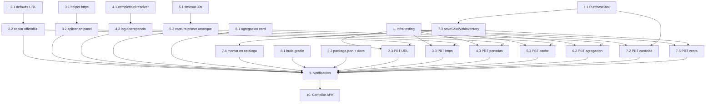

# Implementation Plan

## Overview

Plan de implementación para cerrar la experiencia de catálogo y compra de Vivo Promotor. Cubre exactamente los puntos reportados como faltantes (Purchase_Box/flujo de compra, versionado 0.4.5/10, captura offline automática en primera apertura, timeout de 30 s, validación de URLs https, defaults de URLs oficiales por modelo, y registro de discrepancias de color) además de la infraestructura de tests (Vitest + fast-check), las 11 propiedades de correctitud, la verificación previa y la compilación final del APK. Todo cambio es aditivo y respeta zonas protegidas: no cambia `applicationId`, no toca comisiones ni el flujo de venta existente (`saveSaleWithInventory` se reutiliza sin modificar), no borra llaves `vivo_*`.

## Tasks

- [x] 1. Configurar infraestructura de testing (Vitest + fast-check)
  - Agregar `vitest` y `fast-check` como devDependencies aisladas (no afectan el empaquetado Android).
  - Configurar Vitest sobre Vite 6 (entorno jsdom para componentes, node para lógica pura).
  - Agregar script `test` en `package.json` sin alterar los scripts existentes (`dev`, `build`, `lint`, `android:*`).
  - Cada test de propiedad debe correr mínimo 100 iteraciones (`fc.assert(fc.property(...), { numRuns: 100 })`).
  - _Requirements: soporte de Testing Strategy (Propiedades 1–11)_

- [x] 2. Sembrar URLs oficiales por defecto por modelo sin sobrescribir configuración del usuario
- [x] 2.1 Agregar `officialUrl` por defecto a cada entrada de `DEFAULT_DEVICES` en `src/lib/constants.ts`
  - y04 → `https://www.vivo.com/mx/products/y04`; y21d → `https://www.vivo.com/mx/products/y21d`; y29 → `https://www.vivo.com/mx/products/y29-4g`; y31d → `https://www.vivo.com/mx/products/y31d`; v50-lite → `https://www.vivo.com/mx/products/v50-lite`; v60-lite → `https://www.vivo.com/mx/products/v60-lite`.
  - _Requirements: 3.1, 3.2, 3.3, 3.4, 3.5, 3.6, 3.7_
- [x] 2.2 Hacer que `createPhoneModelFromDevice` en `src/lib/storage.ts` copie `officialUrl` del default al `canonicalModel`
  - Verificar que `repairPhoneModelsCatalog` mantenga `storedModel.officialUrl ?? canonicalModel.officialUrl` (preservación del valor del usuario) sin tocar comisiones ni ventas.
  - _Requirements: 3.8_
- [x] 2.3 Escribir test de propiedad para preservación idempotente de la URL del usuario (Property 5)
  - _Requirements: 3.8_

- [x] 3. Validación estricta de URLs oficiales (https absoluta)
- [x] 3.1 Agregar helper `isValidHttpsUrl` (URL absoluta con esquema `https`) en el módulo de catálogo
  - _Requirements: 3.11_
- [x] 3.2 Aplicar la validación antes de abrir la web en `src/features/catalog/WebPreviewPanel.tsx`
  - Rechazar apertura si no es https absoluta, conservar el valor almacenado y mostrar mensaje "La URL configurada es inválida".
  - Deshabilitar la acción y mostrar CTA a Ajustes cuando no hay `officialUrl`.
  - _Requirements: 3.9, 3.11_
- [x] 3.3 Escribir test de propiedad para validación https (Property 6)
  - _Requirements: 3.11_

- [x] 4. Resolución de portadas por nombre de archivo y detección de discrepancia
- [x] 4.1 Verificar completitud del Cover_Resolver (6 modelos × 2 variantes = 12) y fallback SVG en `src/lib/officialDeviceCovers.ts`
  - Confirmar mapeo exacto de las 12 portadas, conservando typos `vivoy21d_negrto_jade` y `vivoy29_black_exxpresso` tal cual.
  - _Requirements: 1.1, 1.2, 1.3, 1.4, 1.5, 1.6, 1.7, 1.8, 1.9, 1.11, 1.12, 2.5_
- [x] 4.2 Agregar registro (log) de discrepancia color declarado vs. derivado del archivo
  - `console.warn` con `{ variantId, colorDeclarado, colorDerivado }` solo cuando difieren tras `normalizeTextKey`; la imagen sigue al archivo (Y04 → Verde Jade; Y21d conserva Negro Jade).
  - _Requirements: 2.1, 2.2, 2.3, 2.4, 2.6_
- [x] 4.3 Escribir tests de propiedad: normalización (P1), completitud resolver (P2), prioridad portada (P3), discrepancia (P4)
  - _Requirements: 1.10, 1.1, 1.2, 1.11, 2.1, 2.2, 2.6, 5.7_

- [x] 5. Captura offline automática en primera apertura con timeout de 30 s
- [x] 5.1 Envolver el fetch del HTML base con `AbortController` + timeout de 30 s en `src/lib/webArchive.ts`
  - Si expira o no hay HTML útil → `Cache_Status = bloqueado` con motivo; conservar estados `sin_cache | cache_completo | cache_parcial | bloqueado`.
  - _Requirements: 4.3, 4.6, 4.10_
- [x] 5.2 Disparar captura automática (best-effort) en primer arranque desde `WebPreviewPanel.tsx`
  - Al abrir un modelo con `officialUrl` y sin `WebArchiveRecord` previo, lanzar `captureWebArchiveForModel` una sola vez en segundo plano; mantener botón manual "Guardar offline" y "Actualizar offline".
  - Persistir solo en IndexedDB (nunca localStorage); respetar `WEB_ARCHIVE_MODEL_LIMIT_BYTES`.
  - _Requirements: 4.1, 4.2, 4.4, 4.5, 4.7, 4.8, 4.9, 4.11, 4.12_
- [x] 5.3 Escribir test de propiedad/edge para el conjunto de Cache_Status con fetch mockeado (Property 7)
  - _Requirements: 4.10_

- [x] 6. Visualización de los 6 modelos: agregación de Model_Card
- [x] 6.1 Verificar/ajustar el cálculo de stock total y rango de margen (min–max) en `src/features/CatalogSection.tsx`
  - Mantener representación con `VivoPhoneIcon` (SVG), orden desde `modelOrdering.ts`, y estado vacío cuando no hay modelos activos.
  - _Requirements: 5.1, 5.2, 5.3, 5.6, 5.9_
- [x] 6.2 Escribir tests de propiedad: agregación Model_Card (P8) y ordenamiento estable (P9)
  - _Requirements: 5.3, 5.6, 5.1_

- [x] 7. Interfaz de compra (Purchase_Box / Purchase_Flow)
- [x] 7.1 Crear `src/features/catalog/PurchaseBox.tsx` como componente nuevo y aislado
  - Pasos: seleccionar modelo activo → variante activa → mostrar color, portada oficial y stock (entero ≥ 0) → input de cantidad `[1, stock]`.
  - Bloqueos: sin variantes activas ("No hay variantes disponibles"), stock 0 ("Agotado"), cantidad inválida (mostrar rango válido y stock actual).
  - Estilo alineado a `LiquidGlassSurface`, tokens `--neo-*`, mobile-first y claro/oscuro.
  - _Requirements: 6.2, 6.3, 6.4, 6.5, 6.6, 6.10, 6.13_
- [x] 7.2 Agregar helper `isValidQuantity` y test de propiedad de validación de cantidad (Property 10)
  - _Requirements: 6.5, 6.6, 6.13_
- [x] 7.3 Conectar la confirmación de compra a `saveSaleWithInventory` de `storage.ts` sin modificar su implementación
  - Construir `SaleRecord` con snapshots; en éxito mostrar confirmación (modelo + color + cantidad); en error abortar sin descontar stock y preservar estado; preservar comisiones.
  - _Requirements: 6.7, 6.8, 6.9, 6.11, 6.12, 6.14_
- [x] 7.4 Renderizar `PurchaseBox` como último elemento del catálogo en `src/features/CatalogSection.tsx`
  - Después de todas las Model_Card y de la tarjeta de academia (Smart Club).
  - _Requirements: 6.1_
- [x] 7.5 Escribir test de propiedad de invariantes de inventario y comisión de la venta (Property 11)
  - Con localStorage mockeado.
  - _Requirements: 6.8, 6.11_

- [x] 8. Versionado / actualizabilidad
- [x] 8.1 Subir versión en `android/app/build.gradle`: `versionCode` 9 → 10 y `versionName` "0.4.4" → "0.4.5"
  - NO cambiar `applicationId` `com.davidsanchez.vivopromotor`.
  - _Requirements: Plan de versionado (Design)_
- [x] 8.2 Alinear `package.json` `version` a `0.4.5` y actualizar `TECH_STACK.md` (versionCode 10, versionName 0.4.5)
  - _Requirements: Plan de versionado (Design)_

- [x] 9. Verificación previa a la entrega
  - `npm run lint` (`tsc --noEmit`) sin errores.
  - `npm run build` exitoso.
  - Suite Vitest en verde con las 11 propiedades a ≥100 iteraciones.
  - Confirmar que migraciones no destruyen llaves `vivo_*`, ventas ni historial.
  - _Requirements: Testing Strategy (Design)_

- [x] 10. Compilación y entrega del APK
  - Ejecutar `npm run android:deliver` (`scripts/android-build-debug.ps1 -Deliver`).
  - Salida esperada: `dist-apk/vivo-promotor-debug.apk` con `versionCode 10` / `versionName 0.4.5`, instalable sobre la app anterior.
  - _Requirements: Plan de compilación / entrega del APK (Design)_

## Task Dependency Graph



```json
{
  "waves": [
    { "wave": 1, "tasks": ["1", "2.1", "3.1", "4.1", "5.1", "6.1", "7.1", "8.1", "8.2"] },
    { "wave": 2, "tasks": ["2.2", "3.2", "4.2", "5.2", "7.3"] },
    { "wave": 3, "tasks": ["2.3", "3.3", "4.3", "5.3", "6.2", "7.2", "7.4", "7.5"] },
    { "wave": 4, "tasks": ["9"] },
    { "wave": 5, "tasks": ["10"] }
  ]
}
```

## Notes

- Zonas protegidas (AGENTS.md / CODEX_GUARDRAILS.md): no cambiar `applicationId`; no modificar comisiones, backup/import/export ni el flujo de venta existente; `saveSaleWithInventory` se reutiliza sin alterar su implementación.
- Todos los cambios de datos son aditivos e idempotentes; no se usa `localStorage.clear()` ni se borran llaves `vivo_*`.
- Portadas oficiales: el nombre de archivo es la fuente de verdad; los typos `negrto` y `exxpresso` se conservan.
- Datos pesados de caché web viven solo en IndexedDB, nunca en localStorage.
- La tarea 10 (compilación) es un proceso largo en Windows; produce `dist-apk/vivo-promotor-debug.apk` (con fallback versionado si el nombre fijo está bloqueado).
