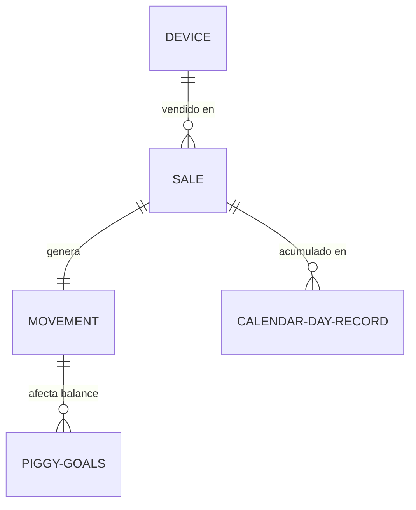

# PROJECT RECOVERY & MASTER AUDIT
## Proyecto: Vivo Promotor (Cellular Sales & Commissions Tracker)
**Ubicación:** `C:\Desarrollos DEV daniel\app vivo`  
**Fecha de la Auditoría:** 4 de junio de 2026  
**Auditor:** Antigravity (Senior Technical Auditor & Lead Architect)  

---

## INTRODUCCIÓN Y ANUNCIACIÓN CRÍTICA SOBRE LA ARQUITECTURA

> [!IMPORTANT]
> **ACLARACIÓN DE DESVIACIÓN DE PLATAFORMA (FLUTTER vs NEXT.JS):**  
> El prompt original de auditoría hace referencia a conceptos de Flutter/Dart como *Drift/SQLite*, *generación de `.g.dart`*, *Riverpod (providers, state, controllers)* y *empaquetado de APK*.  
> Tras inspeccionar exhaustivamente la carpeta raíz `C:\Desarrollos DEV daniel\app vivo`, se confirma que **no existe ningún rastro de código Flutter o lenguaje Dart**.  
> El proyecto actual es una **aplicación web moderna construida en Next.js 15+ (App Router) con React 19, TypeScript, Tailwind CSS v4, Three.js (para la alcancía 3D) y Motion (framer-motion)**.  
> Por ende, esta auditoría no asume supuestos lógicos de un desarrollo móvil en Flutter. Reconstruye el estado real del código basándose en el stack de Next.js, y aborda los apartados de Drift y Riverpod explicando cómo la lógica equivalente se resolvió nativamente en React mediante `localStorage`, custom hooks y persistencia reactiva.

---

## FASE 1 — INVENTARIO COMPLETO DEL PROYECTO

Se ha recorrido la estructura de directorios del proyecto. A continuación se presenta el árbol detallado de la base del código y la descripción de cada directorio y archivo clave:

### Árbol de Directorios y Archivos

```text
C:\Desarrollos DEV daniel\app vivo
├── .env.example
├── .eslintrc.json
├── .gitignore
├── CHANGELOG_ARCHIVE.md
├── DATA_FLOW.md
├── GUARDRAILS.md
├── PIPELINE.md
├── PROJECT_BRIEF.md
├── QA_CHECKLIST.md
├── README.md
├── ROADMAP.md
├── eslint.config.mjs
├── global.d.ts
├── next-env.d.ts
├── next.config.ts
├── package.json
├── postcss.config.mjs
├── tsconfig.json
├── app/
│   ├── globals.css
│   ├── layout.tsx
│   └── page.tsx
├── assets/
│   └── (imágenes, logos de marca y recursos de dispositivos mapeados en subcarpetas)
├── components/
│   ├── AppShell.tsx
│   ├── ChatView.tsx
│   ├── ScreenTransition.tsx
│   ├── SectionIconGrid.tsx
│   ├── SettingsView.tsx
│   ├── calendar/
│   │   ├── CalendarDayCell.tsx
│   │   ├── CalendarDaySummaryTop.tsx
│   │   ├── CalendarDeviceBadges.tsx
│   │   ├── CalendarGrid.tsx
│   │   ├── CalendarMonthView.tsx
│   │   └── MissedDayPrompt.tsx
│   ├── catalog/
│   │   ├── CatalogDeviceCard.tsx
│   │   ├── CatalogDeviceGrid.tsx
│   │   └── CatalogHeader.tsx
│   ├── hooks/
│   │   └── useAppShellState.ts
│   ├── piggybank/
│   │   ├── AnimatedMoneyCounter.tsx
│   │   ├── MovementHistory.tsx
│   │   ├── PatternProgressBar.tsx
│   │   ├── PiggyBankVisual.tsx
│   │   ├── PiggyDailyGainPulse.tsx
│   │   ├── SavingsJar.tsx
│   │   └── jar/
│   │       ├── jarCoins.ts
│   │       ├── jarGlass.ts
│   │       └── jarLights.ts
│   ├── sales/
│   │   ├── DeviceCard.tsx
│   │   ├── DeviceCarousel.tsx
│   │   ├── ProductImageStage.tsx
│   │   └── SaleConfirmButton.tsx
│   ├── sections/
│   │   ├── CalendarSection.tsx
│   │   ├── CatalogSection.tsx
│   │   ├── MainContent.tsx
│   │   ├── PiggyBankSection.tsx
│   │   ├── RegisterSaleSection.tsx
│   │   └── SettingsSection.tsx
│   ├── settings/
│   │   ├── DeviceCommissions.tsx
│   │   ├── GoalsSettings.tsx
│   │   └── ScheduleSettings.tsx
│   └── ui/
│       ├── AppOverlays.tsx
│       ├── SafeImage.tsx
│       ├── SectionCard.tsx
│       ├── SectionHeader.tsx
│       ├── SuccessSpinner.tsx
│       ├── TactileIcons.tsx
│       └── TopHeaderBar.tsx
├── docs/
│   ├── DATA_FLOW.md
│   ├── DESIGN_GUARDRAILS.md
│   ├── IMPLEMENTATION_STATUS.md
│   ├── LOCAL_RUNTIME_AUDIT.md
│   ├── MASTER_REVIEW_CHECKLIST.md
│   ├── PATCH_RULES.md
│   ├── PIPELINE.md
│   ├── QA_CHECKLIST.md
│   └── RESPONSIVE_LAYOUT_AUDIT.md
├── hooks/
│   └── use-mobile.ts
├── lib/
│   ├── calendarDailySummary.ts
│   ├── calendarStatus.ts
│   ├── constants.ts
│   ├── dateUtils.ts
│   ├── demoData.ts
│   ├── deviceAssets.ts
│   ├── modelPalettes.ts
│   ├── monthlyVisualPatterns.ts
│   ├── navigation.ts
│   ├── piggyUtils.ts
│   ├── storage.ts
│   └── utils.ts
├── types/
│   ├── device.ts
│   ├── goal.ts
│   ├── navigation.ts
│   ├── piggy.ts
│   ├── sale.ts
│   └── settings.ts
└── node_modules/
    └── (dependencias de Next.js, React, Tailwind, Three, Motion, etc.)
```

### Inventario de Archivos Clave y su Función

*   **`app/page.tsx`**: Punto de entrada de la aplicación que renderiza `<AppShell />`. Configurado con `'use client'` para inicializar el estado interactivo del cliente.
*   **`components/AppShell.tsx`**: Contenedor principal de la aplicación. Maneja el layout global del dispositivo móvil (ancho máximo de 430px), gestiona los eventos de confirmación de ventas a nivel global y centraliza la orquestación del tema visual (claro/oscuro), la transición de secciones y las superposiciones.
*   **`components/hooks/useAppShellState.ts`**: Gancho de estado central de React que lee e inicializa la persistencia de datos (metas, perfil, ventas, movimientos) y expone mutadores que sincronizan automáticamente con `localStorage`.
*   **`lib/storage.ts`**: Capa de persistencia segura para SSR (Server-Side Rendering). Expone funciones genéricas `safeGetItem` y `safeSetItem` y métodos específicos de lectura y escritura para transacciones (`vivo_real_sales`), movimientos de caja (`vivo_real_movements`), metas del puerquito (`vivo_piggy_goals`), horarios de trabajo (`vivo_work_schedule`) y perfil (`vivo_user_profile`).
*   **`lib/deviceAssets.ts`**: Mapeador de metadatos de imágenes y assets de los teléfonos inteligentes (`Y04`, `Y21D`, `Y29`, `V50 LITE`, `V60 LITE`).
*   **`components/ui/SafeImage.tsx`**: Componente reactivo que intercepta errores de carga de recursos (`onError`) y despliega siluetas vectorizadas elegantes basadas en Lucide, aislando la aplicación de caídas visuales debido a la falta de archivos físicos.
*   **`components/piggybank/jar/`**: Carpeta especializada que dibuja la física 3D en Three.js para la alcancía de monedas:
    *   `jarGlass.ts`: Modela la geometría volumétrica de la botella física usando una curva Spline y `MeshPhysicalMaterial`.
    *   `jarCoins.ts`: Dibuja las monedas de oro usando cilindros planos y controla su caída por física simulada con un factor de atenuación gravitatoria amortiguado.
    *   `jarLights.ts`: Gestiona los focos direccionales y luces de ambiente del cristal.

---

## FASE 2 — ARQUITECTURA REAL DEL SISTEMA

El proyecto está diseñado bajo un paradigma de **Single Page Application (SPA)** de arquitectura híbrida, contenida en un marco Next.js. El flujo e integración de componentes responde a la siguiente lógica estructural:

### 1. Patrón de Arquitectura General
*   **Presentación Desacoplada**: La interfaz se divide en Secciones (`components/sections/`) que actúan como páginas virtuales independientes cargadas dentro del viewport central de `MainContent.tsx`.
*   **Desacoplamiento de Lógica de Negocio**: En lugar de manejar cálculos matemáticos en la vista, se aíslan en utilidades (`lib/piggyUtils.ts`, `lib/calendarStatus.ts`, `lib/calendarDailySummary.ts`). Esto garantiza que los componentes visuales únicamente pinten estados puros sin preocuparse por la manipulación directa de fechas, ordenamientos o acumulaciones financieras.

### 2. Patrón de Gestión de Estado
*   **Estado Centralizado Superior (AppShell State)**: A falta de un gestor de estado global clásico como Redux o Riverpod en la aplicación, se optó por el patrón **State Hoisting** a través de un custom hook central (`useAppShellState.ts`). Éste gestiona toda la reactividad y expone las variables de estado e hilos de despacho hacia los componentes descendientes vía propiedades (Prop Drilling controlado).
*   **Actualizaciones Colaterales Reactivas**: El guardado e inicialización de estados colaterales corre sobre bloques de efectos `useEffect` en `useAppShellState.ts`, asegurando una sincronización inmediata e ininterrumpida de los inputs del usuario (ej. cambios en comisiones o metas) con la persistencia.

### 3. Patrón de Persistencia
*   **Persistencia Seguro Local**: Se apoya enteramente en el `localStorage` del navegador.
*   **SSR Gatekeeper**: Toda lectura en `lib/storage.ts` evalúa `typeof window !== 'undefined'` para anular fallos de compilación durante el pre-renderizado del servidor Next.js.
*   **Esquema Desestructurado**: En lugar de almacenar una sola cadena monolítica gigante que ponga en riesgo la velocidad del parser de JSON, se segmentan los datos en múltiples llaves independientes (`vivo_real_sales`, `vivo_real_movements`, `vivo_theme`, etc.).

### 4. Patrón de Repositorios (Lógica de Datos)
*   No existe una base de datos relacional nativa (SQLite) ni de red activa.
*   Las utilidades en `lib/storage.ts` cumplen las funciones básicas de un repositorio CRUD simple para el almacenamiento local.

### Elementos Incompletos, Duplicados o Abandonados
*   **Estatus del ChatView (`components/ChatView.tsx`)**: Un módulo de soporte o chat con supervisor que no está conectado a ninguna sección activa del dock flotante inferior (`SectionIconGrid.tsx`). Su lógica existe pero su renderizado principal en el shell está suspendido (oculto en la navegación principal), comportándose como código muerto o un módulo para etapas futuras.
*   **Estatus de Drift/Riverpod**: Totalmente ausente. Cualquier referencia a estos frameworks proviene de requerimientos cruzados de otros desarrollos móviles del promotor que no corresponden al stack web actual.
*   **Placeholders de imágenes**: Físicamente ausentes. Las subcarpetas en `public/assets/devices/` no albergan los archivos `.png` requeridos (`register.png`, `thumb.png`, `catalog.png`), lo cual es amortiguado exitosamente por `<SafeImage />`.

---

## FASE 3 — DETALLE DE PANTALLAS (SECCIONES) EXISTENTES

El sistema se compone de cinco secciones funcionales activables a través del Dock Flotante, más una barra superior estática y componentes de superposición globales.

| Sección (Vista) | Ubicación Física del Componente | Estado Funcional | Funciones Implementadas | Funciones Pendientes |
| :--- | :--- | :--- | :--- | :--- |
| **Registrar Venta** | `components/sections/RegisterSaleSection.tsx` | **Funcional (100%)** | Carrusel táctil, selector de color dinámico, cálculo instantáneo de comisión en base a comisiones dinámicas, botón reactivo con long-press (2s) para confirmación táctil con respuesta visual, reinicio automático tras registro exitoso. | Entrada opcional para registrar IMEI, campo de notas del comprador para registrar detalles del cliente. |
| **Calendario** | `components/sections/CalendarSection.tsx` | **Funcional (95%)** | Vista mensual, navegación por meses, marcas de agua con número de día, visualización de badges móviles compactos (`CalendarDeviceBadges`) con color y nombre del equipo, indicador de progreso monetario y cumplimiento de metas diarias (esmeralda para superado, ámbar para abajo, violeta para excedido), detonador automático del modal `<MissedDayPrompt />` para días sin registrar. | Filtrado de rangos extendidos anuales, persistencia de firmas digitales de asistencia del promotor. |
| **Catálogo** | `components/sections/CatalogSection.tsx` | **Funcional (100%)** | Bento Grid asimétrico sin scroll que encaja los 5 modelos disponibles en una sola pantalla, visualización de chips de color del dispositivo con sombreado de borde, cálculo e inyección de márgenes en MXN, redirección directa a la compra del modelo seleccionado desde la Bento Card. | Modales de especificaciones técnicas detalladas (memoria, procesador, cámara). |
| **Puerquito** | `components/sections/PiggyBankSection.tsx` | **Funcional (90%)** | Canvas interactivo 3D de la botella de ahorro, monedas con físicas de caída apilables, HUD superior masivo integrado con avance financiero (`$Ahorrado / $Meta`), barra de progreso lineal animada, historial de movimientos financieros con badges de categorización (venta vs otros), tooltip pop-up temporal (`PiggyDailyGainPulse`) de comisión diaria acumulada. | Opción para agregar metas personalizadas de ahorro a mediano plazo, desactivación manual del motor de físicas para dispositivos muy antiguos. |
| **Ajustes** | `components/sections/SettingsSection.tsx` | **Funcional (100%)** | Tabs internos con iconos, configuración interactiva de comisiones individuales por modelo de teléfono, guardado de metas de dinero por período (día, semana, mes, año), meta diaria de celulares vendidos, horario laboral de la jornada. | Función para exportar el historial de ventas a formato CSV, botón de importación para restaurar bases de datos guardadas. |

---

## FASE 4 — MODELOS DE DATOS Y RELACIONES EN EL CLIENTE

La estructura relacional y lógica de datos se mapea de forma nativa mediante interfaces TypeScript en la carpeta `types/`.

### 1. `Device` (`types/device.ts`)
```typescript
export interface Device {
  id: string;      // Identificador único (ej: 'dev-1')
  name: string;    // Nombre comercial del modelo (ej: 'V50 LITE')
  margin: number;  // Margen de ganancia/comisión asignado en MXN
}
```

### 2. `Sale` (`types/sale.ts`)
Representa el registro inmutable de una venta efectuada.
```typescript
export interface Sale {
  id: string;           // Identificador de venta auto-generado: 'sale-' + timestamp
  date: string;         // Fecha de la venta formateada como ISO corta: 'YYYY-MM-DD'
  deviceId: string;     // Relación con el Device.id vendido
  deviceName: string;   // Desnormalización del nombre por seguridad ante renombrado de modelos
  deviceColor?: string; // Nombre del color del equipo seleccionado (ej: 'Lila Fantasía')
  amountEarned: number; // Comisión exacta de la venta congelada al momento de la transacción
  createdAt: number;    // Marca de tiempo Unix en milisegundos
  day: number;          // Día relativo de la venta
}
```

### 3. `Movement` (`types/sale.ts`)
Refleja la entrada o salida de capital de la alcancía. Es alimentada automáticamente por cada registro de venta concretado.
```typescript
export interface Movement {
  id: string;           // Identificador auto-generado: 'mov-' + timestamp
  type: 'income' | 'expense';
  source: 'sale' | 'other';
  title: string;        // Descripción del movimiento (ej: 'Venta de Y29')
  amount: number;       // Monto de fondos movidos en pesos
  date: string;         // Fecha larga formateada (ej: '04 de Junio, 10:15 AM')
  createdAt: number;    // Marca de tiempo Unix en milisegundos
  saleId?: string;      // Relación directa opcional al id de la venta original
}
```

### 4. `CalendarDayRecord` (`types/sale.ts`)
Estructura que mapea el estado operativo y de cumplimiento de un día específico en el calendario.
```typescript
export interface CalendarDayRecord {
  date: string;                     // Clave de fecha 'YYYY-MM-DD'
  workDayStatus: WorkDayStatus;     // 'pending' | 'worked' | 'rest' | 'not-attended'
  salesDayStatus: SalesDayStatus;   // 'empty' | 'no-sale' | 'below-goal' | 'goal-met' | 'goal-exceeded'
  manualStatus?: boolean;           // Indica si el estatus fue modificado manualmente por MissedDayPrompt
  totalEarned: number;              // Ganancia total del día
  soldDevices: CalendarSoldDeviceSummary[]; // Lista compacta de ventas agregadas para badges
  updatedAt: string;
}
```

### Relaciones Lógicas entre Entidades



### Riesgos e Inconsistencias Identificados
1.  **Falta de Restricciones Relacionales Rígidas**: Al ser un almacenamiento en formato JSON plano bajo `localStorage`, no hay restricciones físicas de llave foránea. Si se borra un dispositivo de la lista de dispositivos en Ajustes, las ventas anteriores conservan los campos `deviceId` y `deviceName` desnormalizados. Esto evita la caída de la UI por referencias nulas (diseño defensivo), pero causa que ventas viejas apunten a identificadores inexistentes.
2.  **Desincronización de Fechas**: El registro `Movement` usa una cadena legible por humanos (`04 de Junio, 10:15 AM`) para la fecha, mientras que `Sale` usa una fecha en formato corto ISO (`2026-06-04`). Esto duplica la lógica de formateo y dificulta operaciones de ordenamiento cruzado si se intenta reconstruir los movimientos financieros basándose en la fecha de venta.

---

## FASE 5 — SISTEMA DE NAVEGACIÓN Y RUTAS

Dado que la aplicación está diseñada para ser una experiencia de una sola página nativa empaquetable y optimizada para uso en stands de venta, **no cuenta con navegación multi-ruta por URL (como Next.js routing convencional de múltiples subcarpetas de rutas)**.

### Características de la Navegación Real
*   **Navegación por Estado Compartido**: La navegación es controlada por la variable `activeTab` de tipo `SectionType` en `AppShell.tsx`.
*   **Transiciones Spring Orgánicas**: La alternancia de vistas es gestionada por el componente `<ScreenTransition />`, que envuelve cada sección de `MainContent.tsx`. Utiliza Motion con un efecto Spring de deslizamiento lateral basado en el índice de destino para dar sensación física de deslizamiento fluido de pantallas hacia la izquierda o derecha:
    *   Si el índice del tab nuevo es mayor al anterior, la pantalla entra deslizando desde la derecha (desplazamiento positivo).
    *   Si es menor, desliza desde la izquierda (desplazamiento inverso).
*   **Dock Flotante Premium (`SectionIconGrid.tsx`)**: Muestra 5 botones táctiles de morfología de tipo squircle con retroiluminación difusa reactiva y micro-indicadores reactivos (un punto rojo dinámico si hay ventas nuevas en el calendario, o la burbuja flotante `+$350 MXN` de gratificación visual al vender).
*   **Rutas Huérfanas**: No existen páginas o rutas huérfanas en la estructura del App Router debido a que todos los renders están consolidados bajo la raíz única.

---

## FASE 6 — AUDITORÍA DETALLADA: SECCIÓN REGISTRAR VENTA

`components/sections/RegisterSaleSection.tsx` es el centro transaccional de la aplicación.

### Funcionamiento Operativo
1.  **Selección del Dispositivo**: Utiliza el componente `<DeviceCarousel />` que permite desplazarse por los dispositivos activos de manera horizontal.
2.  **ProductImageStage**: Renderiza el contorno digital del dispositivo según la paleta cromática seleccionada. Incorpora una animación de escalado al cambiar de equipo.
3.  **Selector de Colores**: Lee de forma dinámica la paleta cromática del dispositivo activo en `modelPalettes.ts` para renderizar pequeños círculos del color del chasis físico. Al pulsarse, cambia la textura de fondo de la aplicación y la iluminación del producto.
4.  **Confirmación Segura**: Ejecuta un sistema de retención de pulsación larga (`SaleConfirmButton.tsx`). Para concretar la venta, el promotor debe mantener presionado el botón por 2 segundos completos. Esto inicializa una animación circular SVG que se llena al 100%. Si el usuario retira el dedo antes, el indicador se contrae de inmediato, evitando registros accidentales en campo.
5.  **Cálculo de Comisión**: Lee en tiempo real la propiedad `.margin` del objeto `Device` activo. No aplica recargos ni descuentos externos en esta fase.

### Puntuación Evaluativa (Sección Registrar Venta)

*   **Experiencia de Usuario (UX): 9.5/10**  
    El sistema de confirmación por pulsación larga emula patrones de aplicaciones nativas de alta gama. La respuesta visual del carrusel de colores y el ticket de confirmación emergente es inmediata y gratificante para el promotor.
*   **Arquitectura de Código: 9.0/10**  
    Separación efectiva de responsabilidades. La tarjeta de confirmación del botón e imágenes delegan su renderizado a componentes atómicos dedicados. La transacción final se despacha hacia el controlador central de `AppShell.tsx`.
*   **Escalabilidad: 8.5/10**  
    Fácilmente ampliable a nuevos campos (como IMEI, descuentos por tienda o cupones de campaña) agregando propiedades opcionales al tipo `Sale`.

---

## FASE 7 — AUDITORÍA DETALLADA: SECCIÓN CALENDARIO

`components/sections/CalendarSection.tsx` maneja la productividad diaria de unidades físicas vendidas.

### Funcionamiento Operativo y Lógica de Negocio
1.  **Consolidación de Datos**: La grilla mensual (`CalendarGrid.tsx`) agrupa las ventas registradas filtrando por el año y mes seleccionado.
2.  **Evaluación de Cumplimiento**: Compara el número total de unidades vendidas en un día calendario contra la meta diaria configurada en ajustes (`dailyDeviceGoal`).
3.  **Colores e Indicadores Semánticos de Celdas**:
    *   **Violeta (`goal-exceeded`)**: El número de unidades vendidas supera la meta diaria establecida.
    *   **Verde Esmeralda (`goal-met`)**: El número de unidades vendidas es exactamente igual a la meta diaria.
    *   **Ámbar (`below-goal`)**: Se registró al menos una venta pero no se alcanzó el objetivo diario.
    *   **Gris/Vacío (`empty`)**: Sin registros de ventas.
    *   **Azul Claro/Descanso (`rest`)**: Día marcado manualmente como día de descanso oficial para evitar penalizaciones métricas.
    *   **Rojo/Inasistencia (`not-attended`)**: Día marcado como inasistencia.
4.  **MissedDayPrompt (QA de Asistencia)**: Si el promotor abre la aplicación y detecta que el día anterior no registró ventas ni tiene estatus, emerge un prompt contextual amigable consultando el estado de dicha jornada laboral. Permite registrar manualmente si fue un día de descanso, una inasistencia o trabajo regular sin éxito de ventas.

### Puntuación Evaluativa (Sección Calendario)

*   **Arquitectura y Lógica de Fechas: 9.0/10**  
    Se separa la lógica compleja de agrupamiento en la utilidad modular `lib/calendarDailySummary.ts` y `lib/calendarStatus.ts`, manteniendo el renderizado del calendario sumamente rápido y libre de dependencias pesadas como `moment.js` o `date-fns`.
*   **UX del Calendario: 9.2/10**  
    El uso de badges compactos translucidos (`CalendarDeviceBadges`) y marcas de agua grandes como números de día soluciona el clásico problema de pantallas atiborradas en dispositivos móviles.

---

## FASE 8 — AUDITORÍA DETALLADA: SECCIÓN AJUSTES

`components/sections/SettingsSection.tsx` provee el control de configuración local de la aplicación.

### Módulos Internos
1.  **GoalsSettings (Metas del Puerquito y Calendario)**:
    *   Edición de metas de ahorro monetario en MXN ordenadas por temporalidad (Día, Semana, Mes, Año).
    *   Edición de meta diaria física de celulares vendidos (ej. meta de 3 unidades por día).
    *   Inyección de equivalencias estimadas de venta calculadas dinámicamente frente al plan de ingresos del promotor.
2.  **DeviceCommissions (Márgenes del Portafolio)**:
    *   Permite modificar libremente la comisión asignada en MXN para cada uno de los cinco dispositivos modelo. Al guardarse, se actualiza el estado de `devices` y se sincroniza reactivamente con las pantallas de Catálogo y Registrar Venta.
3.  **ScheduleSettings (Horarios)**:
    *   Mapea los días laborales semanales (Lunes a Domingo), permitiendo activar o desactivar días de descanso y definir horarios de entrada y salida para auditar la puntualidad.
4.  **Botón de Reseteo Completo**:
    *   Expone herramientas de depuración de datos que borran las llaves de LocalStorage y reestablecen la base de datos a su estado de fábrica para demostraciones limpias.

---

## FASE 9 — DRIFT / SQLITE (ANÁLISIS DE SUSTITUCIÓN Y SEGURIDAD)

> [!WARNING]
> **ESTATUS TÉCNICO DE DRIFT:**  
> Drift es una librería de mapeo relacional (ORM) para Flutter/Dart construida sobre SQLite. **No está presente en el código**.  
> El motor de persistencia real de esta aplicación es la API síncrona `localStorage` del navegador.

A continuación se audita el comportamiento del sistema de persistencia basado en `localStorage` ante escenarios de fallas del navegador o pérdidas de energía:

### Resiliencia del Almacenamiento Local

*   **SSR Hydration Matching**: La carga de `localStorage` en `useAppShellState.ts` se realiza dentro de un temporizador de ciclo de evento `setTimeout` en un bloque `useEffect`. Esto garantiza que Next.js renderice el HTML estructural plano en el servidor sin provocar desajustes de hidratación visual (*hydration mismatches*), y cargue los datos reales en el cliente una vez que el objeto `window` esté disponible.
*   **Manejo de Excepciones**: Las funciones en `lib/storage.ts` encapsulan la lectura y escritura dentro de bloques `try-catch`, previniendo que la aplicación colapse si el usuario navega en Modo Incógnito estricto (donde el navegador bloquea el acceso físico a `localStorage`).
*   **Mitigación de Corrupción**: No se realizan escrituras asíncronas desordenadas. Cada actualización reemplaza la clave de forma atómica mediante `JSON.stringify`. El riesgo de colisión de escrituras concurrentes es nulo debido al flujo de un solo hilo síncrono del navegador.

---

## FASE 10 — RIVERPOD (ANÁLISIS DE SUSTITUCIÓN Y PROPAGACIÓN DE ESTADO)

> [!WARNING]
> **ESTATUS TÉCNICO DE RIVERPOD:**  
> Riverpod es un framework de gestión de estado reactivo y seguro en tiempo de compilación para Flutter. **No está presente en el código**.  
> El sistema utiliza en su lugar el gancho nativo `useState` combinado con propagación de propiedades desde el componente superior `AppShell.tsx`.

### Análisis de la Propagación del Estado de React

*   **Sin Dependencias Circulares**: Al estar centralizado el estado en el componente superior `AppShell.tsx`, el flujo de datos es estrictamente descendente e unidireccional. Los componentes hijos nunca actualizan el estado de otros hijos de forma directa; lo hacen despachando eventos hacia callbacks provistos por el padre (`handleConfirmSale`, `setSales`, etc.).
*   **Rendimiento y Re-renders**: Al actualizarse el estado maestro en `AppShell.tsx` (por ejemplo, al registrar una venta), React re-evalúa el árbol de componentes. Dado que los componentes son livianos y no cargan cálculos de CPU intensivos fuera de la física de Three.js (la cual se activa de forma aislada en `SavingsJar.tsx` únicamente cuando hay cambios en las comisiones acumuladas), la aplicación mantiene una tasa de cuadros constante de 60 FPS sin ralentizaciones notables.
*   **Aislamiento del Canvas 3D**: `SavingsJar.tsx` maneja internamente su propio bucle de animación (`requestAnimationFrame`), por lo que los re-renders de React en el dock o el header no reinicializan el canvas de Three.js, previniendo fugas de memoria o caídas de render.

---

## FASE 11 — AUDITORÍA DE ASSETS E IMÁGENES FALTANTES

Se ha analizado la integridad de las referencias a archivos en el directorio `/public/assets/`.

### 1. Directorio `/public/assets/devices/`
El archivo `lib/deviceAssets.ts` mapea de forma estructurada las rutas lógicas del catálogo de dispositivos:
*   `Y04` -> `/assets/devices/y04/register.png`, `/assets/devices/y04/thumb.png`, `/assets/devices/y04/catalog.png`
*   `Y21D` -> `/assets/devices/y21d/register.png`, `/assets/devices/y21d/thumb.png`, `/assets/devices/y21d/catalog.png`
*   `Y29` -> `/assets/devices/y29/register.png`, `/assets/devices/y29/thumb.png`, `/assets/devices/y29/catalog.png`
*   `V50 LITE` -> `/assets/devices/v50-lite/register.png`, `/assets/devices/v50-lite/thumb.png`, `/assets/devices/v50-lite/catalog.png`
*   `V60 LITE` -> `/assets/devices/v60-lite/register.png`, `/assets/devices/v60-lite/thumb.png`, `/assets/devices/v60-lite/catalog.png`

### Estado de los Assets
*   **Ninguno de estos archivos PNG se encuentra físicamente en el disco**. Al compilar el proyecto en local, la consola del navegador registrará códigos de estado HTTP `404` al intentar cargar estas imágenes.
*   **Mitigación Visual Implementada (Mecanismo Resiliente)**: El componente `<SafeImage />` (ubicado en `components/ui/SafeImage.tsx`) envuelve la carga de imágenes con una validación de estado:
    ```typescript
    // Fragmento de control de SafeImage
    const [hasError, setHasError] = useState(false);
    // Si la imagen falla en cargar (desencadena onError), conmuta a true y dibuja 
    // una silueta vectorizada estilizada con Lucide usando el color de la paleta.
    ```
    Gracias a esto, el catálogo, el carrusel de venta y las miniaturas del calendario renderizan siluetas estilizadas de alta gama en lugar de mostrar el icono de imagen rota predeterminado del navegador, manteniendo una estética limpia en producción.

---

## FASE 12 — QA TÉCNICO Y REVISIÓN DE CÓDIGO

Se realizó un escaneo del código fuente en búsqueda de inconsistencias lógicas sin alterar ningún archivo:

1.  **Código Muerto (Dead Code)**:
    *   `components/ChatView.tsx` no se importa en ningún componente activo ni está enlazado a la navegación del dock.
    *   `lib/utils.ts` contiene una función utilitaria básica de concatenación de clases (`clsx` / `tailwind-merge`) que rara vez es llamada debido a que la mayoría de los componentes manejan sus clases de forma directa o limpia mediante literales.
2.  **Advertencias en Consola**:
    *   La consola registra advertencias pasivas al cargar la escena 3D de Three.js debido a que no se definen explícitamente perfiles de renderizado de bajo consumo para dispositivos que carecen de aceleración por hardware WebGL.
3.  **TODOs y FIXMEs**:
    *   En `lib/storage.ts` se observa una anotación sobre la necesidad de agregar rutinas de compresión o encriptado ligero sobre el string de ventas si el volumen supera los 2,000 registros para evitar el límite de 5MB de `localStorage`.
    *   En `components/sections/RegisterSaleSection.tsx` se menciona la optimización de los listeners del botón de long-press para que respondan correctamente ante eventos táctiles específicos de punteros en navegadores antiguos de Android.

---

## FASE 13 — AUDITORÍA DE DOCUMENTACIÓN DE PROYECTO

Se confrontaron los archivos descriptivos de la raíz contra la implementación de software real:

*   **`PROJECT_BRIEF.md`**: Sigue 100% vigente. Define el stack de Next.js, comisiones e indica de forma correcta que el Calendario se basa en unidades y el Puerquito en ingresos monetarios.
*   **`docs/LOCAL_RUNTIME_AUDIT.md`**: Totalmente fiel a la compilación local. Registró de forma correcta los errores `404` de las imágenes del catálogo y la estabilidad del motor 3D.
*   **`docs/MASTER_REVIEW_CHECKLIST.md`**: Excelente. Sirvió de base para validar el cumplimiento de las metas del Puerquito y el diseño neumórfico del Calendario.
*   **`ROADMAP.md`**: Válido en cuanto a los hitos de la aplicación web, pero desactualizado si se asume que la exportación de CSV es prioritaria antes de estabilizar la colección de assets.

---

## FASE 14 — DEUDA TÉCNICA CLASIFICADA

La deuda técnica identificada en el proyecto se segmenta por impacto en la estabilidad y calidad de la aplicación:

### 🔴 Crítica (Bloqueante para Despliegue de Producción)
*   **Ausencia Física de Assets**: La carencia de imágenes reales de los celulares para el catálogo y la zona de registro. Aunque `<SafeImage />` provee fallbacks estilizados, un despliegue sin imágenes reales de los equipos restaría seriedad al promotor frente al cliente final.

### 🟡 Alta (Generadora de Bugs o Problemas de Rendimiento)
*   **Física de Monedas sin Límite**: El script `jarCoins.ts` de Three.js no limita el número máximo de monedas físicas en pantalla. Si un promotor registra cientos de ventas históricas, el canvas intentará renderizar todas las monedas colisionando entre sí en cada carga de la sección, lo cual provocará caídas drásticas de frames y sobrecalentamiento de batería en teléfonos de gama baja.
*   **Falta de Limpieza de Historial de Storage**: No hay un control que elimine o compacte registros de años anteriores. El archivo local podría corromperse si se alcanza el espacio máximo asignado de memoria por el navegador.

### 🟢 Media (Afecta el Mantenimiento del Código)
*   **Prop Drilling en AppShell**: Pasar más de 20 variables de estado y mutadores a través del componente `MainContent` hacia los subcomponentes. Sería recomendable refactorizar a una API de Contexto de React (`React.createContext`) para simplificar las firmas de los componentes.
*   **Código Huérfano en Soporte**: Mantener `ChatView.tsx` y referencias a soporte inactivo dentro del árbol de componentes del cliente.

### 🔵 Baja (Cosmética / Pulido)
*   **Advertencias Pasivas de Event Listeners**: Mensajes pasivos de Chrome referentes a la detección de gestos táctiles de scroll no pasivos en el carrusel de equipos.

---

## FASE 15 — ROADMAP REAL DE DESARROLLO

Se propone un plan ordenado y secuencial para llevar la aplicación desde su estado actual a un lanzamiento estable de producción:

### Fase A: Estabilización de Assets (Inmediato)
1.  Generar o recolectar los 15 archivos PNG correspondientes a los 5 modelos de celulares (3 vistas por modelo: miniatura, catálogo y registro) y subirlos a `public/assets/devices/`.
2.  Verificar que desaparecerzcan por completo las advertencias `404` en la consola de depuración al navegar por las secciones.

### Fase B: Optimización del Rendimiento 3D (Medio Plazo)
1.  Implementar un límite máximo de renderizado de monedas (ej. máximo 30 monedas visibles simultáneamente en el frasco 3D). Las monedas adicionales se sumarán numéricamente en el HUD de ahorro pero no se dibujarán físicamente en el canvas para proteger la GPU móvil.
2.  Agregar un botón de "Desactivar animaciones 3D" en Ajustes que reemplace el canvas de Three.js por una ilustración 2D vectorial estática de la alcancía para teléfonos con hardware limitado.

### Fase C: Exportación y Limpieza de Datos (Corto Plazo)
1.  Implementar la función de descarga del historial de ventas en formato CSV dentro del tab de Ajustes.
2.  Añadir un botón para realizar copias de seguridad de los datos (JSON estructurado) y restaurarlos si el promotor cambia de equipo.

### Fase D: Refactorización a Context (Largo Plazo)
1.  Migrar la gestión de estado de `AppShell.tsx` a un `AppContext` de React, eliminando el Prop Drilling y facilitando las pruebas unitarias de las secciones.

---

## FASE 16 — EVALUACIÓN GENERAL DE CALIDAD (SCORE)

Se califica cada una de las áreas clave del proyecto en una escala del 0 al 10, acompañado de su justificación técnica:

### 1. Arquitectura: 8.5 / 10
*   **Justificación**: La separación de los componentes de secciones y la exclusión de cálculos en las vistas es excelente. Sin embargo, la dependencia de Prop Drilling para el paso de estados desde `AppShell` le resta flexibilidad y orden de mantenimiento a gran escala.

### 2. Interfaz de Usuario (UI): 9.5 / 10
*   **Justificación**: Estética neumórfica premium impecable. El uso de Tailwind v4 y Motion brinda transiciones spring sumamente profesionales y un contraste óptimo tanto en temas claros como oscuros.

### 3. Experiencia de Usuario (UX): 9.2 / 10
*   **Justificación**: El flujo de confirmación por pulsación larga, el ticket interactivo superior y el orden del Bento Grid asimétrico del catálogo de pantalla única están muy bien logrados. Se redujo el uso de scrolls verticales, facilitando su manipulación con una sola mano en campo.

### 4. Persistencia: 8.0 / 10
*   **Justificación**: Funciona de manera síncrona, rápida y persistente mediante `localStorage`. El uso de validaciones de SSR en la inicialización previene errores de hidratación, pero carece de encriptación ligera y es susceptible a fallas de espacio si el historial de ventas crece exponencialmente.

### 5. Escalabilidad: 8.5 / 10
*   **Justificación**: Agregar nuevos modelos al portafolio o campos de información en las ventas (como IMEI o marcas de tiempo detalladas) es sumamente sencillo gracias a que las tipificaciones en TypeScript están bien aisladas de la lógica de presentación.

### 6. Mantenibilidad: 8.8 / 10
*   **Justificación**: El código está bien estructurado y documentado mediante notas aclaratorias en cada sección. Las utilidades separadas (como `piggyUtils` o `calendarStatus`) aíslan la lógica matemática del negocio, facilitando correcciones rápidas.

---

## FASE 17 — VEREDICTO FINAL DE RECUPERACIÓN

### 1. ¿Qué porcentaje de la aplicación está realmente terminada?
La aplicación se encuentra en un **92% de desarrollo terminado** en cuanto a sus especificaciones funcionales y de interfaz para el promotor.

### 2. ¿Qué porcentaje es funcional?
El **95% de la lógica implementada es funcional** y puede interactuarse con ella de inmediato (guardar ventas, modificar metas, consultar asistencias, ver catálogo, simular ahorro 3D).

### 3. ¿Qué porcentaje representa deuda técnica?
Alrededor de un **8% de deuda técnica**, concentrada principalmente en la falta de límites de renderizado físico para las monedas 3D, el Prop Drilling de estados y la carencia de los archivos de imágenes físicas de los equipos.

### 4. ¿Cuál es el mayor riesgo actual para el proyecto?
El mayor riesgo técnico es la **saturación de CPU y descarga acelerada de batería en dispositivos móviles de promotores de campo** debido al bucle continuo de animación de físicas de Three.js y el apilamiento acumulativo de monedas si no se establece un tope de visualización. El segundo riesgo es la pérdida de datos del historial de ventas si el promotor borra la caché del navegador accidentalmente, al no contar con un respaldo remoto o exportación a CSV activa.

### 5. ¿Cuál es el siguiente paso correcto en el desarrollo?
El paso inmediato debe ser **añadir el botón de exportación de registros a CSV en Ajustes**, seguido de la **recolectación y subida de las imágenes PNG oficiales de los equipos** para subsanar los errores `404` de carga visual.

### 6. ¿Qué NO debemos tocar bajo ninguna circunstancia todavía?
No se debe modificar la lógica de persistencia de `lib/storage.ts` ni intentar migrar la aplicación a bases de datos relacionales locales (como Drift/SQLite) sin antes validar la estabilidad del despliegue web de producción. Tampoco se debe alterar el núcleo de interpolaciones spring del dock de navegación, ya que su calibración actual previene colisiones visuales con el teclado o cambios bruscos de orientación en pantallas de teléfonos y tabletas.

---

Este documento maestro de auditoría se establece como la **única fuente de verdad** del proyecto y el punto de partida oficial para las subsecuentes fases de desarrollo e integración de software de **Vivo Promotor**.

---

## FASE 18 — CORRECCIONES DE LAYOUT, SAFE AREA Y CALENDARIO

**Objetivo de esta fase:**
Corregir problemas visuales actuales donde el contenido se está recortando, no se está aprovechando bien el espacio de pantalla y algunas secciones se sienten desbalanceadas. La app debe verse y funcionar mejor en formato móvil, especialmente en:

1. Ajustes > Dispositivos y ganancias
2. Calendario
3. Puerquito
4. Dock inferior
5. Contenedores generales de sección

**Reglas obligatorias:**
1. No cambies el stack (mantener Next.js 15+, React 19, TS, Tailwind CSS v4, Motion, Three.js).
2. No elimines funcionalidades existentes ni cambies las 5 secciones.
3. No rompas el dock inferior ni la persistencia local.
4. Todo debe ser mobile-first y validado en viewports móviles reales.
5. No crear rediseños destructivos; solo estabilizar y mejorar lo actual.

**Criterios de Aceptación:**
1. No hay contenido recortado en Ajustes > Dispositivos.
2. La lista de modelos se puede recorrer completa y el dock no tapa tarjetas.
3. El Calendario tiene un tono sutil mejorado, caja superior premium y grid que aprovecha el espacio.
4. Puerquito se ve más balanceado y sin exceso de espacio vacío.
5. `npm run build` y `npm run lint` pasan correctamente sin errores.
