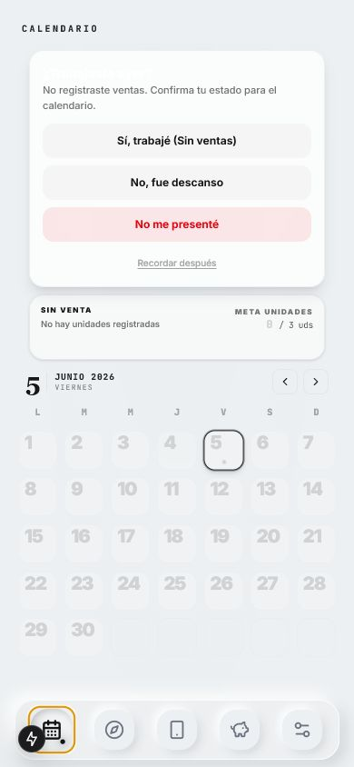
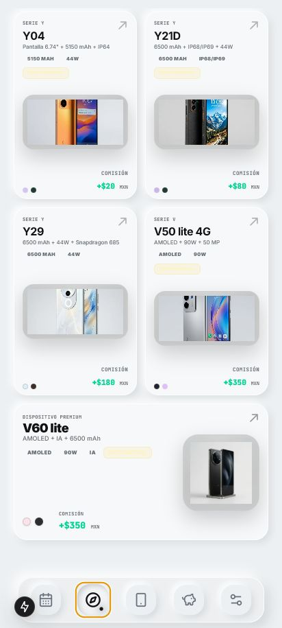
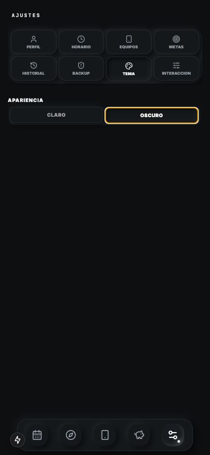
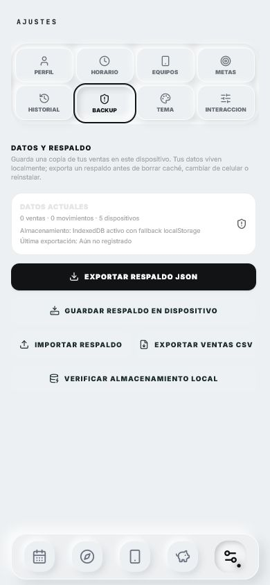
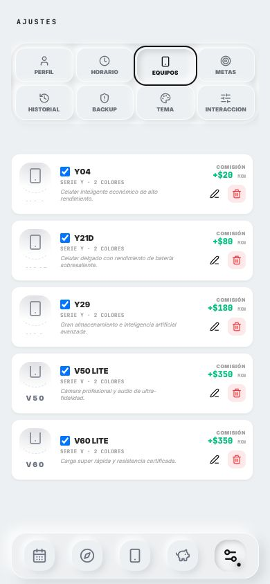

# Vivo Promotor

Vivo Promotor es una app local-first para promotores de venta que registra ventas de equipos Vivo, organiza el calendario comercial, acumula comisiones en el Puerquito y mantiene respaldo/exportación sin depender de nube.

El producto activo corre sobre `Next.js + Capacitor Android`, con una línea Kotlin/Compose paralela dentro de `android/` para futuras integraciones más nativas sin perder datos ni capacidad de actualización.

## Estado actual

- Versión web/app preparada: `0.3.0`
- Android: `versionCode 3`, `versionName 0.3.0`
- Persistencia: `localStorage` + `IndexedDB`
- Contrato de datos: backup JSON v1 compatible
- Migración Kotlin: base Room + DataStore + parser de backup ya creada

## Lo más importante de 0.3.0

- Registro de ventas en cualquier fecha comercial.
- Calendario sin límites artificiales por año.
- Puerquito, historial y backup alineados con la misma fecha comercial.
- Rediseño neumórfico monocromo refinado.
- Ajustes corregido para evitar recortes de contenido en móviles.
- Auditoría de mejoras Android modernas documentada.

## Capturas

| Registro | Calendario | Catálogo |
|---|---|---|
|  |  |  |

| Ajustes oscuro | Ajustes backup | Ajustes equipos |
|---|---|---|
|  |  |  |

## Stack

- Next.js 15
- React 19 RC
- TypeScript
- Tailwind CSS v4 beta
- Motion
- Three.js
- Capacitor 8
- Kotlin + Jetpack Compose + Room + DataStore como línea nativa en progreso

## Comandos principales

```bash
npm install
npm run dev
npm run lint
npm run build
npm run android:prepare
```

Android local:

```powershell
Set-Location -LiteralPath 'C:\Desarrollos DEV daniel\app vivo\android'
.\gradlew.bat assembleDebug --console=plain
.\gradlew.bat testDebugUnitTest lintDebug --console=plain
```

## Estructura

```txt
app/              App Router
components/       UI principal por secciones
hooks/            hooks locales
lib/              storage, backup, fechas, negocio y utilidades
types/            contratos TypeScript
public/           assets e identidad de marca
android/          proyecto Capacitor + base Kotlin/Compose
docs/             documentación viva, QA y roadmap
```

## Documentación clave

- [TECH_STACK.md](TECH_STACK.md)
- [ARCHITECTURE.md](ARCHITECTURE.md)
- [DESIGN.md](DESIGN.md)
- [CODEX_GUARDRAILS.md](CODEX_GUARDRAILS.md)
- [docs/RELEASE_NOTES_0.3.0.md](docs/RELEASE_NOTES_0.3.0.md)
- [docs/ANDROID_OS_ENHANCEMENT_AUDIT.md](docs/ANDROID_OS_ENHANCEMENT_AUDIT.md)

## Android y publicación

- El artefacto debug actual de referencia vive fuera del repo como `dist-apk/vivo-promotor-debug.apk`.
- La release estable pública sigue condicionada a una keystore real fuera del repositorio.
- El repositorio público documenta código, diseño, capturas y estado técnico; no versiona secretos ni artefactos generados pesados.

## Validación reciente

Confirmado en esta base:

- `npm run lint`
- `npm run build`
- `npm run android:prepare`

Pendiente en el entorno local de este turno:

- `android/gradlew.bat assembleDebug` cuando `JAVA_HOME` esté configurado.
